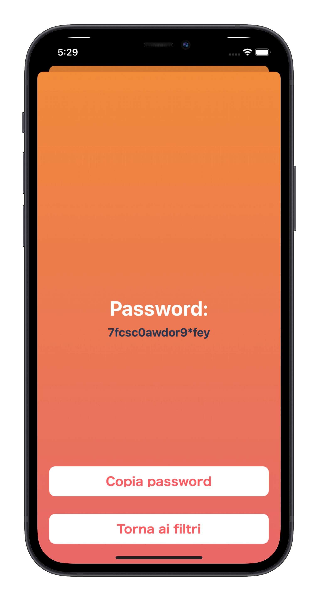

# PSWGenerator
Semplice app sviluppata in Swift che genera password casuali sulla base di filtri personalizzabili.  
Implementata seguendo il pattern MVC.

Launch Screen             |  Main Screen                          |  Screen showing the password
:-------------------------:|:-------------------------:|:-------------------------:
  |  |  
